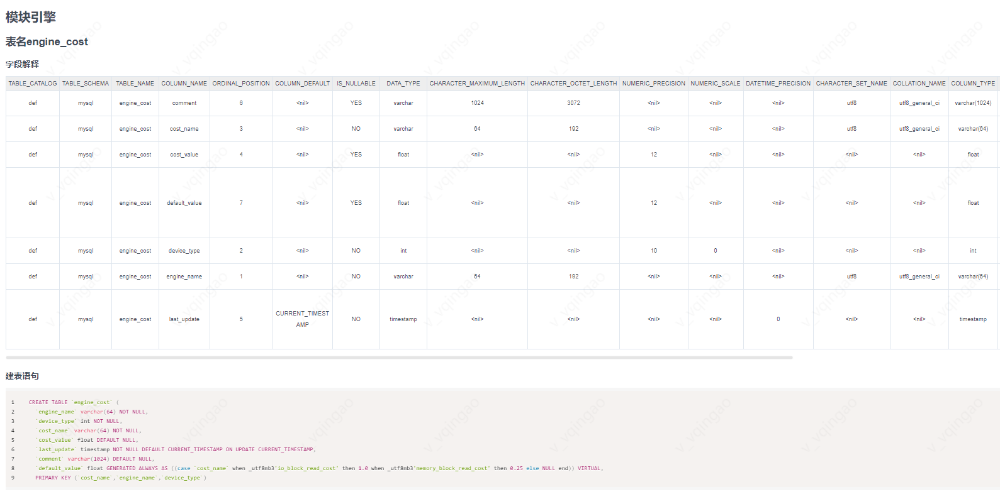

## 简介

该仓库下模块为工作中的小工具，提高工作效率。

邮箱：**ggolang@163.com**

## go-mysql-table-to-markdown 导出表结构并生成Markdown文件

  1. git clone https://github.com/qingolang/go-tools.git
  2. cd go-tools
  3. go mod tidy
  4. cd go-mysql-table-to-markdown
  5. 修改 config.go 中的配置
  6. go run .
  7. 生成 *.md 文件
